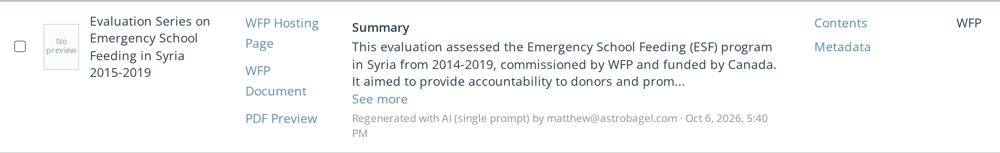
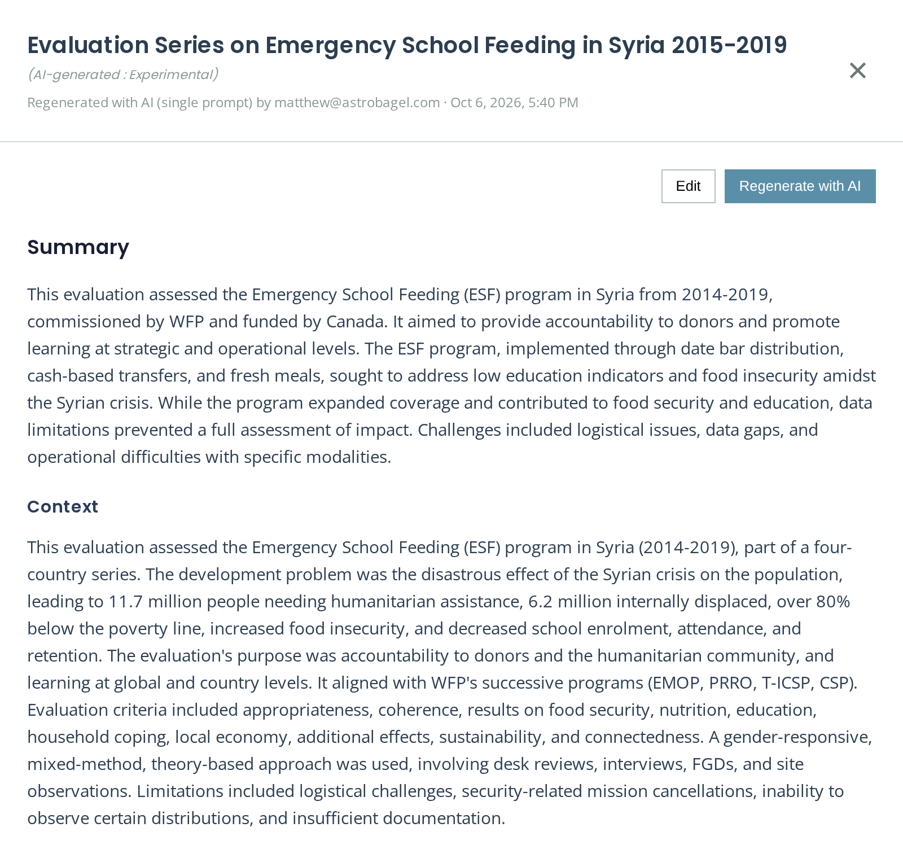
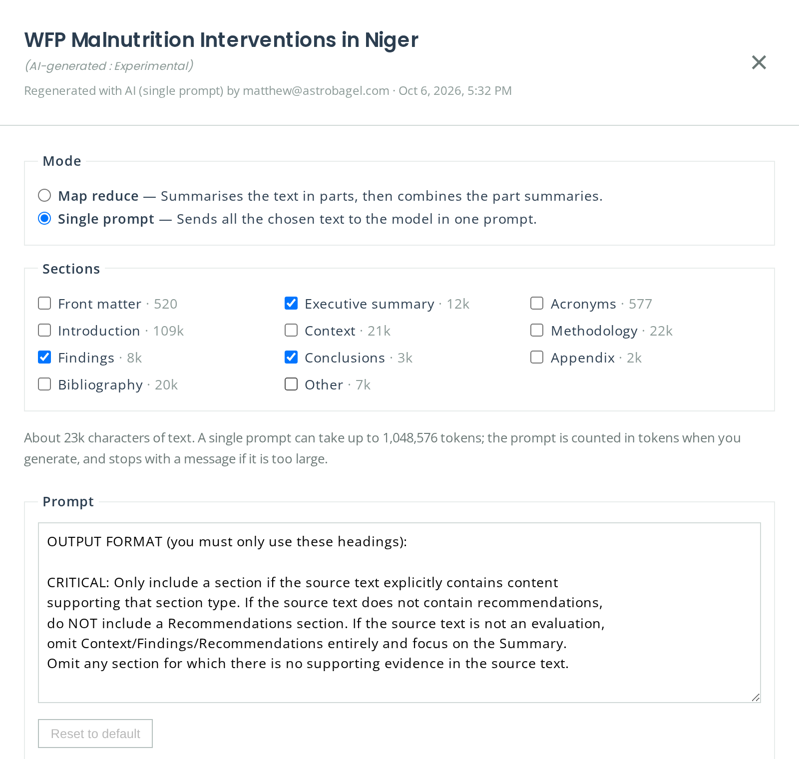
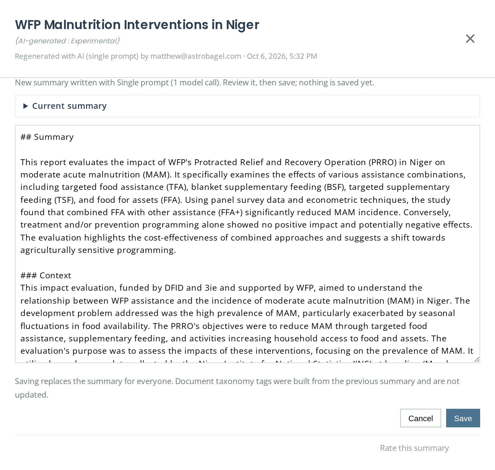
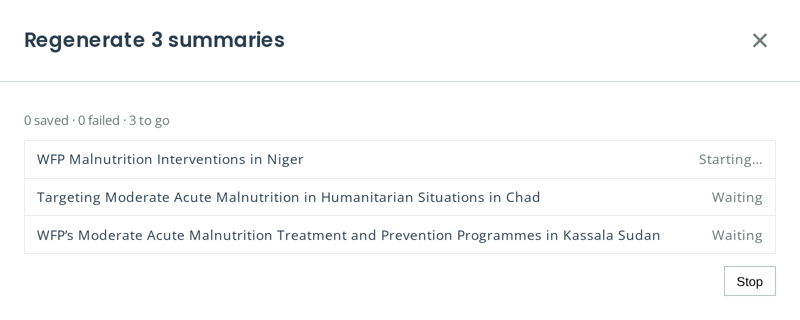
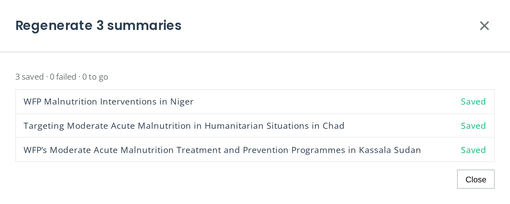

## Document Summaries

Every document has an AI-generated summary, written by the pipeline and shown in the **Summary** column of the Documents Library (Documents tab). Administrators (superusers) can edit a summary, regenerate it with AI, or regenerate the summaries of many documents at once, choosing how the summary is written each time.

Everyone else sees summaries read-only. Clicking a summary opens it in full.

Under every summary, in the table and when it is open, a line says how it was made and when, and who made it if a person did: for example *Written by the pipeline · 12 Jun 2026, 20:24*, *Regenerated with AI (map reduce) by a.person@example.org · 6 Oct 2026, 17:55* or *Edited by a.person@example.org · …*.

### Summary settings

Summaries regenerated in the app use three settings. Each starts from the data source's `pipeline.summarize` configuration in `config.json`, then the group's defaults if it has any (see [Group Settings](user-administration.md#document-summaries)), and can be changed each time you generate.

| Setting | What it does |
|---------|--------------|
| **Mode** | **Map reduce** summarises the text in parts and then combines the part summaries. **Single prompt** sends all the chosen text to the model in one prompt, which needs a model with a large enough context. |
| **Sections** | Which sections' text is summarised, for example the executive summary, findings and recommendations without the annexes. The list shows how much text each section holds. A document whose sections have not been classified yet is summarised from all its text. |
| **Prompt** | What the summary must contain: its headings, length and rules. **Reset to default** returns to the group's or the built-in prompt. |

With **Single prompt**, the dialog shows how much text the chosen sections hold and the most tokens a single prompt can take: 1,048,576 by default, Gemini 2.5 Flash's input limit, or `summarize.single_prompt_context_window` (see [Pipeline Configuration](pipeline-configuration.md#summarize)). When you generate, the prompt is counted in tokens by the model; if it is too large, generating stops before calling the model with a message naming both numbers, and you can choose fewer sections or use map reduce. Single prompt needs a model that counts its tokens exactly, so it is not offered for Hugging Face models. As a guide, a whole 1.7 million-character evaluation report was about 546,000 tokens with Gemini.

Summaries are written by the summarization model of the model combo selected at the top of the page.

### Editing or regenerating one summary

1. Click the document's summary (or **Add summary** where there is none).
2. Click **Edit** to change the text yourself, or **Regenerate with AI** to write a new one.
3. For **Regenerate with AI**, adjust the mode, sections and prompt, then click **Generate**. Progress is shown as the model works; **Stop** abandons the run.
   

4. The new summary opens in the editor with the current one beside it under **Current summary**. Nothing is saved yet: review it, change it if you like, then click **Save**, or **Cancel** to keep the current summary.

   

### Regenerating many summaries

1. Tick the documents in the Documents Library, or use **Select all on this page**. Ticks are kept when you move between pages.

   
2. Click **Regenerate summaries (N)** and choose the mode, sections and prompt.
3. Click **Regenerate and save**. Documents are queued and processed one at a time; each summary is saved as soon as it is ready, and the list shows every document's progress. A document that fails is listed with the reason and the rest carry on.
   

4. **Stop** abandons the documents still running or waiting; their summaries are not changed.

   

Keep the page open until the run finishes: the work is driven from your browser.

### What saving changes

- The summary is replaced for everyone. The save is recorded in the audit log as a `document_summary_updated` event with the document, the administrator, their IP address and how the summary was made (`ui_map_reduce`, `ui_single_prompt` or `ui_edited`).
- **Reprocessing keeps it.** When a document whose summary was set in the app is reprocessed, you are asked whether to keep that summary or replace it with a new one from the pipeline.
- **Taxonomy tags are not updated.** Document-level taxonomy tags were built from the previous summary; reprocess the document if they should follow the new one.
- **The pipeline is not affected.** Group defaults and the choices made in the app apply only to summaries made in the app. The pipeline always uses `config.json` and the built-in prompt.
