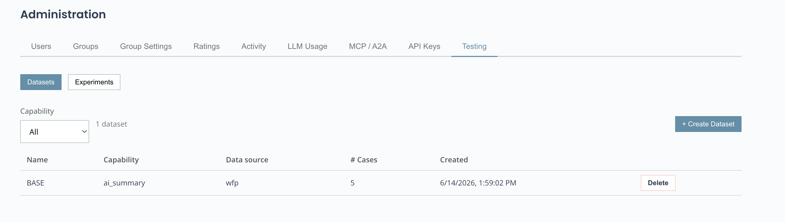
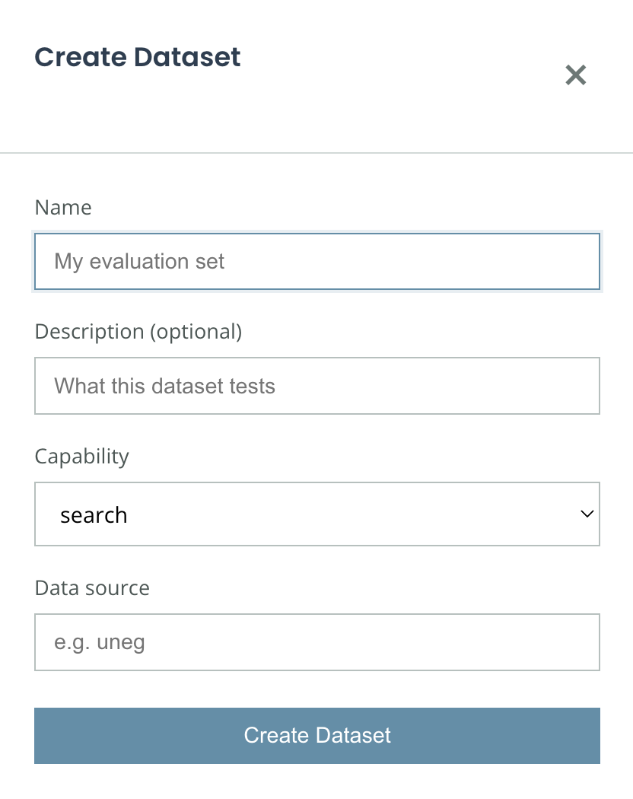
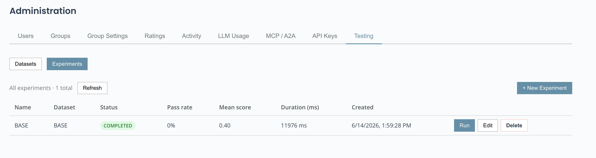
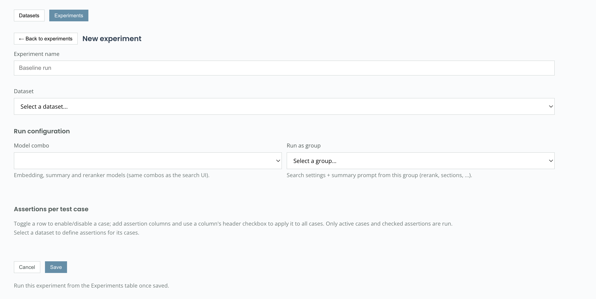
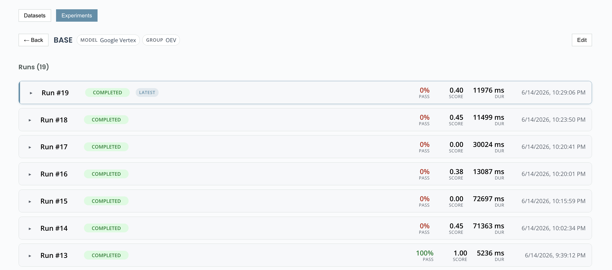
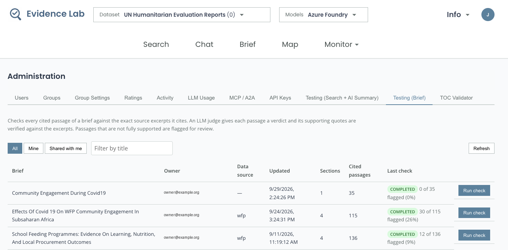
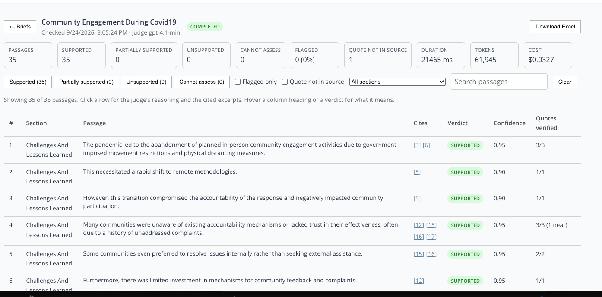
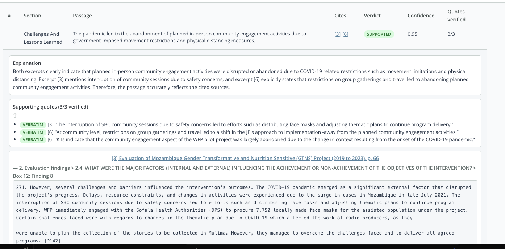
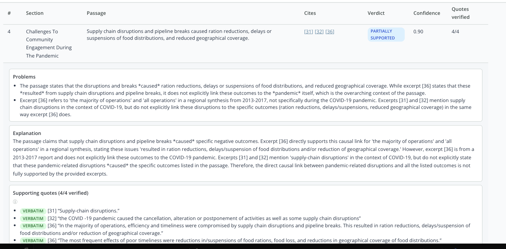

## Evaluation Harness

The **Evaluation Harness** is a superuser-only admin tool for testing the quality of Evidence Lab's **Search**, **AI‑Summary** and **Brief** capabilities. You define reusable **datasets** of test cases, build **experiments** that define what a good result looks like, **run** them against the live system, and **review** per‑case pass/fail with full detail.

It runs the *real* search and AI‑summary code paths — the same retrieval pipeline, model combos, and group settings users experience — so results reflect production behaviour.

> The harness is **internal evaluation/regression tooling** and is only visible to superusers. It is never shown to ordinary users.

---

### Where to find it

Open the **Admin** panel. **Testing (Search + AI Summary)** has two sub‑views, **Datasets** and **Experiments**; **Testing (Brief)** holds the [Brief citation check](#brief-citation-check).

The typical workflow is:

1. **Create a dataset** of inputs (queries + optional filters).
2. **Create an experiment** on that dataset — choose a model combo / group and define the expectations.
3. **Run** the experiment.
4. **View** the runs and per‑case results.

---

### Quickstart: Load dataset and experiment in one file

If you already have your questions **and** the expected answers in a spreadsheet, use **+ Create Dataset and Experiment** (in the **Datasets** sub‑view) to do everything in one upload: it creates a dataset of the questions **and** a draft experiment with one **LLM‑judge** expectation per row, where each row is judged against its own expected answer.

The CSV is the **same format as the dataset upload** (see [Add test cases](#add-test-cases)) plus one extra column:

| Column | Required | Notes |
|--------|----------|-------|
| `query` | yes | The question / search query. |
| `expectation` | yes | Free text describing the expected answer. Becomes that row's **LLM‑judge rubric** (per‑case override). |
| `tags` | no | Separated by `;` within the cell. |
| `notes` | no | Free text. |
| `filters` | no | JSON object — see [Filtering a case](#filtering-a-case). |

In the **Create Dataset and Experiment** dialog you provide:

- **Name** — saved as `<name>_dataset` and `<name>_experiment`.
- **What to test** — `search` or `ai_summary`. The expectation column drives an **LLM‑judge** expectation, which evaluates the AI summary, so choose **`ai_summary`** for it to apply.
- **Data source**, **Model combo**, **Run as group**, and the **judge threshold** (default `0.7`) — the same run configuration as a normal experiment (see [Run configuration](#run-configuration)).
- The **CSV file** (a **sample format** download is provided).

Each row's question and expectation stay paired at the row level. The import is atomic — if anything fails part‑way, the partially‑created dataset is removed so you can retry cleanly. Once created, run it from the **Experiments** table like any other experiment ([Run an experiment](#3-run-an-experiment)).

> Prefer to define expectations by hand, or build a `search` experiment? Use the manual path below instead.

---

### Manual path: build a dataset and experiment step by step

Create the **dataset** and the **experiment** separately — use this when you want to define expectations by hand or build a `search` experiment. The steps below cover the full workflow.

### 1. Create a dataset

A **dataset** is a reusable set of **test cases** for one capability. Datasets hold *inputs only* — the expectations live on the experiment, so the same dataset can be evaluated under different expectations.

In **Datasets**, click **New Dataset** and provide:

- **Name** — e.g. `BASE`.
- **Capability** — `search` or `ai_summary`.
- **Data source** — which indexed collection to query (e.g. `wfp`).

#### Add test cases

Open the dataset to manage its cases. Each case is a **query** plus optional **filters/params**, **tags**, and **notes**, shown as a table.

You can add cases two ways:

- **+ Add case** — enter a single case by hand.
- **Upload CSV** — bulk‑import cases. Click **sample format** (directly under the button) to download a template. Uploading **appends** to whatever is already in the dataset.

The CSV columns are:

| Column | Required | Notes |
|--------|----------|-------|
| `query` | yes | The search query / question. |
| `tags` | no | Separated by `;` within the cell, e.g. `regression;baseline`. |
| `notes` | no | Free text. |
| `filters` | no | JSON object — see [Filtering a case](#filtering-a-case). |

#### Filtering a case

Filters restrict which documents a case searches, using the **same filter
fields the search page offers** for the dataset's data source — they come from
the data source's configuration (`config.json`), not from a fixed list. With
**+ Add case** the editor shows one control per configured field: a **document
picker** (type to search real document titles) when the source declares a
title filter, a **value picker** for each facet field (populated from the data
source's values, e.g. country, region, document type, language), and **min /
max inputs** for each numeric range field (e.g. publication year). Anything a
case carries beyond those fields (e.g. `params` from an import) is shown
read-only and kept unchanged when saving. In a CSV `filters` cell you provide
a JSON object:

| Filter | Format | Example |
|--------|--------|---------|
| Specific documents | `doc_titles`: a list of **exact document titles as they appear in the UI** (matched case-insensitively) | `{"doc_titles": ["Evaluation of X", "Annual Report 2021"]}` |
| Facet fields | the configured field name with a list of values | `{"country": ["Kenya"], "region": ["Asia and the Pacific"]}` |
| Range fields | `<field>_min` / `<field>_max` (numbers) | `{"published_year_min": 2018, "published_year_max": 2022}` |

Document-level fields — `doc_titles`, `region`, `language` and the source's
`src_*` fields — are resolved to the matching document IDs at run time, exactly
as the search page does, so you filter by the human-readable value rather than
an internal ID (this also matches documents whose value is not stamped on
individual chunks). A document-level value that matches no document yields
**zero** results for that case (it is never silently ignored), so prefer the
pickers to avoid typos. Search behaviour (e.g. `rerank`, `limit`) belongs in a
case's separate `params` key — set via the API or an import, not a filter.

---

### 2. Create an experiment

An **experiment** pairs a dataset with a **run configuration** and a set of **expectations**. In **Experiments**, click **New Experiment**.

#### Run configuration

- **Model combo** — the embedding, summarization, and reranker models to use. These are the same combos as the app's model menu (filtered to the dataset's data source). New experiments default to the system default combo.
- **Run as group** — optionally run with a user **group's** search settings (rerank, field boosts, section filters, …) and **summary prompt**, reproducing exactly what that group's members experience in the app.

> Tip: pick the same **Model combo** and **Group** your users use so the experiment mirrors real behaviour.

#### Expectations (cases × expectations matrix)

Expectations are defined as a matrix: **rows are the dataset's test cases**, **columns are expectations**.

- Toggle a **row** on/off to include/exclude a case.
- Add an **expectation column** with **+ Expectation**; each column's header has a "select all" checkbox to apply it to every case.
- Each **cell** is a checkbox — whether that expectation applies to that case.
- For an **LLM judge** column, each cell also has an **override** box: type a prompt to judge that specific case differently from the column's default.

Available expectation types include (per capability):

- **Search** — result contains id, result in top‑K, min/max results, ordering, field match.
- **AI‑Summary** — contains / not‑contains text, regex match, min/max length, cites source, and **LLM judge** (a rubric scored 0–1 by an LLM, with a configurable threshold).

The **LLM judge** evaluates the full summary (including resolved citations/references) and is given the underlying search results, so you can write rubrics about **grounding** (e.g. *"every claim is supported by a cited Kenya document"*).

Click **Save** to store the experiment as a draft.

---

### 3. Run an experiment

From the **Experiments** table, click **Run** on a row. The experiment executes in the background (the row shows **running**, then **completed**/**failed**). An experiment can be run **many times** — each run is preserved as its own record. While a run is in progress the button becomes **Cancel**.

---

### 4. View results

Open an experiment to see its **runs**, newest first (the **latest** run is highlighted). Each run shows its pass rate, mean score, and duration, aligned across runs.

Expand a run to see the per‑case results table, and expand a case to see:

- the **Query** and any filters,
- each **expectation** result (pass/fail, score, and — for LLM judge — the exact prompt being judged and the reason), and
- the **Output** (the AI summary with references, or the search result cards) — collapsed by default.

---

### Brief citation check

The **Testing (Brief)** tab checks a finished brief against its own sources. Where the experiments above judge an AI summary against a rubric you write, the citation check needs no expectations: for every sentence of the brief that carries a `[n]` citation, an LLM judge is shown that sentence and the **exact source excerpts it cites**, each introduced by its document title and section heading, and nothing else, and decides whether the sentence is supported by them. Context named in a title or heading (the country, programme or period a document is about) counts as the setting of its excerpt, so a sentence that names it is not overstating.

The list shows every brief in the system, not only your own and the ones shared with you: the harness is an admin tool, so an admin can check any user's brief. The **Mine**, **Shared with me** and **Other users** buttons narrow the list, and each row shows the owner, the number of researched sections and cited passages, and the outcome of the last check. The judge is the summarisation model of the model combo selected in the **Models** menu at the top of the page, so pick the combo first, then click **Run check**. Checks run in the background; the view shows progress per passage and keeps every check as history.

Each passage gets one of four verdicts:

- **Supported** — every factual element is stated in, or directly follows from, the excerpts.
- **Partially supported** — the core statement is there, but at least one element is absent, overstated or altered.
- **Unsupported** — the excerpts do not back the statement, or contradict it.
- **Cannot assess** — the excerpts are empty or unreadable, no source was stored for the citation number, or the judge's answer could not be parsed (the error is shown).

Anything other than *Supported* is **flagged** for review. The judge must also copy the quotes it relies on character for character from the excerpts; each quote is verified mechanically against the excerpt's text and its section heading path (a passage that restates a section title is supported by that title), and a passage whose quote cannot be found in its source is marked **quote not in source**, because a verdict resting on an invented quote deserves extra scrutiny.

The result page shows the verdict counts, the flagged share, tokens and cost, and the passages table. Hover a summary tile, a column heading or a verdict for a plain‑language explanation of what it means. Filter it by verdict, **Flagged only**, **Quote not in source**, section, or free text. The citation numbers in the **Cites** column open the cited passage in Evidence Lab's document preview. Expand a passage to read the problems the judge found, its explanation, its quotes with their verification status (the ⓘ icon explains where those quotes come from), and each cited excerpt; its heading opens the document at that passage. **Download Excel** saves the same data as three sheets: *Flagged*, *All judgements* and *Summary* (the per‑section verdict counts).

A supported passage, with the quotes the judge relied on verified against the excerpt:

A flagged passage, with the problems the judge found:

> The judge sees only the stored excerpts, not the whole document. A passage can be flagged because the brief cites the wrong passage of the right document. Treat flags as a review list, not a final verdict.

---

### Tips

- **Reproduce the app:** match the experiment's **Model combo** and **Run as group** to what users actually use.
- **Re‑run freely:** runs accumulate as history, so you can compare quality across changes.
- **Grounding rubrics:** because the LLM judge sees the sources, you can check that the summary is supported by (and only cites) the right documents.
- **Bulk authoring:** use **Upload CSV** to load many queries at once, then define expectations once on the experiment.
